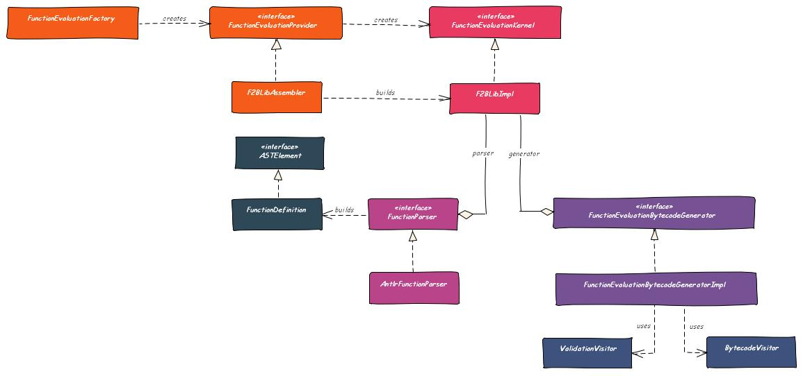

# F2BLib &mdash; Function to Bytecode Library


## TL;TR

Parse mathematical function expressions, convert them to Java bytecode, and evaluate
them _very_ quickly.


## Introduction

F2BLib &ndash; Function to Bytecode Library &ndash; defines a [Grammar](src/main/antlr4/org/f2blib/Functions.g4)
for real-valued mathematical function expressions. It parses an input source using [Antlr4](https://www.antlr.org/)
and converts the resulting abstract syntax tree (AST) to Java bytecode using [ASM](https://asm.ow2.io/). The
functions can then be evaluated _very_ fast.


By real-valued mathematical functions we mean mappings of the form

<center>
<!-- Generated with https://www.mathtowebonline.com/ -->
<math xmlns="http://www.w3.org/1998/Math/MathML">
<mrow>
	<mi>f</mi>
	<mo>:</mo>
	<msup>
		<mi>&#x0211D;</mi>
		<mi>k</mi>
	</msup>
	<mo>&#x000D7;</mo>
	<msup>
		<mi>&#x0211D;</mi>
		<mi>n</mi>
	</msup>
	<mo>&#x02192;</mo>
	<msup>
		<mi>&#x0211D;</mi>
		<mi>m</mi>
	</msup>
	<mo>,</mo>
	<mrow>
		<mo form="prefix">(</mo>
		<mi>p</mi>
		<mo>,</mo>
		<mi>x</mi>
		<mo form="postfix">)</mo>
	</mrow>
	<mo>&#x021A6;</mo>
	<mi>y</mi>
	<mo>:</mo>
	<mo>=</mo>
	<msub>
		<mi>f</mi>
		<mi>p</mi>
	</msub>
	<mrow>
		<mo form="prefix">(</mo>
		<mi>x</mi>
		<mo form="postfix">)</mo>
	</mrow>
</mrow>
</math>
</center>


## Getting Started

Suppose you want to evaluate a real-valued function with two variables and two parameters:

<center>
<math xmlns="http://www.w3.org/1998/Math/MathML">
<mrow>
	<msub>
		<mi>f</mi>
		<mi>p</mi>
	</msub>
	<mo>:</mo>
	<msup>
		<mi>&#x0211D;</mi>
		<mn>2</mn>
	</msup>
	<mo>&#x02192;</mo>
	<msup>
		<mi>&#x0211D;</mi>
		<mn>2</mn>
	</msup>
	<mo>,</mo>
	<mrow>
		<mo form="prefix">(</mo>
		<mi>x</mi>
		<mo>,</mo>
		<mi>p</mi>
		<mo form="postfix">)</mo>
	</mrow>
	<mo>&#x021A6;</mo>
	<mi>f</mi>
	<mo>:</mo>
	<mo>=</mo>
	<mrow>
		<mo rspace="0.3em" lspace="0em" stretchy="true" fence="true" form="prefix">(</mo>
		<mtable class="m-pmatrix">
			<mtr>
				<mtd>
					<msub>
						<mi>f</mi>
						<mn>1</mn>
					</msub>
				</mtd>
			</mtr>
			<mtr>
				<mtd>
					<msub>
						<mi>f</mi>
						<mn>2</mn>
					</msub>
				</mtd>
			</mtr>
		</mtable>
		<mo rspace="0em" lspace="0.3em" stretchy="true" fence="true" form="postfix">)</mo>
	</mrow>
	<mo>:</mo>
	<mo>=</mo>
	<mrow>
		<mo rspace="0.3em" lspace="0em" stretchy="true" fence="true" form="prefix">(</mo>
		<mtable class="m-pmatrix">
			<mtr>
				<mtd>
					<msub>
						<mi>p</mi>
						<mn>1</mn>
					</msub>
					<mi>sin</mi>
					<msub>
						<mi>x</mi>
						<mn>1</mn>
					</msub>
					<mo>+</mo>
					<msub>
						<mi>x</mi>
						<mn>2</mn>
					</msub>
				</mtd>
			</mtr>
			<mtr>
				<mtd>
					<mi>ln</mi>
					<msub>
						<mi>p</mi>
						<mn>2</mn>
					</msub>
					<mo>+</mo>
					<msup>
						<mi>e</mi>
						<mrow>
							<msub>
								<mi>x</mi>
								<mn>2</mn>
							</msub>
						</mrow>
					</msup>
				</mtd>
			</mtr>
		</mtable>
		<mo rspace="0em" lspace="0.3em" stretchy="true" fence="true" form="postfix">)</mo>
	</mrow>
</mrow>
</math>
</center>

Introduce the property

```
f2blib.version
```

into your Maven `pom.xml` and set it to the version of F2BLib you want to use and declare a dependency like

```xml
<dependency>
    <groupId>org.f2blib</groupId>
    <artifactId>f2blib</artifactId>
    <version>${f2blib.version}</version>
</dependency>
```

Then define a function like in

```java
private static final String FUNCTION = "function some.packagename.SomeClassName;" +
                                       "begin" +
                                       "    f_1 := p_1 * sin(x_1) + x_2;" +
                                       "    f_2 := ln(p_2) + exp(x_2);" +
                                       "end";
```

and obtain a reference to the Function Evaluation Kernel and load the function into the kernel:

```java
FunctionEvaluationKernel kernel = new FunctionEvaluationFactory().get().create();
kernel.load(FUNCTION);
```

Now you can start evaluating the function:

```java
double[] x = new double[]{ 2.51, 1.28 };
double[] p = new double[]{ -1.45, 8.27 };
double[] y = new double[2];

kernel.eval("some.packagename.SomeClassName", p, x, y);
```


## Performance

xxx


## Markov Chains in Finance Mathematics

xxx


## Architecture

The main components of the system interact as follows:




## Build

To build the project and start developing, do

```
$ git clone git@github.com/DrStefanFriedrich/f2blib
$ cd f2blib
$ mvn clean install
```

To run the performance tests, do

```
$ mvn test -Dorg.f2blib.performancetest.enabled=true
```


## Limitations

Right now variables must be named x_i, where i is an integer and parameters must be named p_j, where j is
an integer.


## References

### Parser Generators

Here is a list of parser generators. I used the list during evaluation of the different frameworks.

* [Antlr4](https://www.antlr.org/)
* [JavaCC](https://javacc.org/)
* [Xtext](https://www.eclipse.org/Xtext/)

We decided to use Antlr, because it is very well known and popular. In contrast, Xtext is much more powerful
and has a lot of features we don't need.


### Bytecode Generation

Here is a list of Java bytecode generation frameworks. I used the list during evaluation of the different frameworks.

* [ASM](https://asm.ow2.io/)
* [Commons BCEL](https://commons.apache.org/proper/commons-bcel/)
* [cglib](https://github.com/cglib/cglib)
* [ByteBuddy](https://bytebuddy.net/#/)

ByteBuddy as well as cglib extend ASM. ByteBuddy is optimized for runtime speed. ASM is very small,
very fast, has no dependencies to other libraries, and is a low-level bytecode generation system.
Is also has a class called ASMifier which can transform arbitrary .class files to .java files
containing all the ASM statments needed to reproduce the class. For the last reason we chose ASM.


### Arithmetic Expression Evaluation

Here is a list of mathematical expression evaluation frameworks similar to this one:

* [matheval](http://matheval.sourceforge.net/)
* [exp4j](https://www.objecthunter.net/exp4j/)
* [mXparser](http://mathparser.org/)
* [EvalEx](https://github.com/uklimaschewski/EvalEx)


### Finance Mathematics

* Volkert Paulsen: [Versicherungsmathematik](https://wwwmath.uni-muenster.de/statistik/paulsen/WeiterePublikationen/Versicherungsmathematik.pdf) (only available in German)
* Michael Koller: [Stochastische Modelle in der Versicherungsmathematik und Lebensversicherungsmathematik](http://www.math.ethz.ch/finance/Skripte/LV12_v060_151003.pdf) (only available in German)
* Hartmut Milbrodt, Manfred Helbig: Mathematische Methoden der Personenversicherung, de Gruyter, 1999.


## License

The project is published under the [Eclipse Public License v2.0](LICENSE.txt), which is online available at
[this](https://www.eclipse.org/legal/epl-2.0/) URL.


## Open Issues

* Priority 1: General improvements
  * Implement a lot more unit tests or remove functions from the AST
    * PrettyPrintVisitorTest
    * Check in unit test what happens if we load the same (or a different) function twice
    * ValidationVisitorTest
    * (All visitors must be improved tremendously)
  * Look through everything and identify improvements

* Priority 2: Grammar
  * Improve class name and remove JAVALETTER, JAVALETTERORDIGIT
  * Implement a Visitor to convert CST to AST
  * Check operator precedence
  * NEG, POS
  * Implement unit test for the grammar and parsing

* Priority 3: Finalization
  * Implement getMaxStack
  * Remove 'TODO SF'
  * Finalize the project to some degree (check every single file and ask yourself: can I publish this?)
  * Check test coverage and SonarQube issues
  * 'mvn site'
  * Introduce Gradle?

* Priority 4: Build and Publish in the Cloud
  * Build the project in the cloud
  * Publish the project in the cloud

* Priority 5: Markov Chains
  * Implement integer expressions and IntVisitor
  * DiffVisitor
  * Introduce Sum and Prod
  * Implement For Loops
  * Implement Markov Chains and a performance test
  * Implement more FunctionEvaluationKernel's
  * Are special x86 optimizations of the ASM generated bytecode possible?
