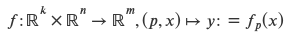
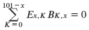

<!----------------------------------------------------------------------------

   Copyright (c) 2019 Stefan Friedrich

   This program and the accompanying materials are made available under the
   terms of the Eclipse Public License 2.0 which is available at
   https://www.eclipse.org/legal/epl-2.0/

   SPDX-License-Identifier: EPL-2.0

 ------------------------------------------------------------------------------>


# F2BLib &mdash; Function to Bytecode Library

[](https://openjdk.java.net/)
[](https://gradle.org/)
[](https://www.eclipse.org/legal/epl-2.0/)
[](https://repo1.maven.org/maven2/com/github/drstefanfriedrich/f2blib/f2blib/1.0.2/)
<br />
[](https://travis-ci.org/DrStefanFriedrich/f2blib)
[](https://sonarcloud.io/dashboard?id=DrStefanFriedrich_f2blib)
[](https://www.javadoc.io/doc/com.github.drstefanfriedrich.f2blib/f2blib)

## TL;TR

Parse mathematical function expressions, convert them to Java bytecode, and evaluate
them _very_ quickly.


## Introduction

F2BLib &ndash; Function to Bytecode Library &ndash; defines a [Grammar](src/main/antlr/com/github/drstefanfriedrich/f2blib/antlr/Functions.g4)
for real-valued mathematical function expressions. It parses an input source using [Antlr4](https://www.antlr.org/)
and converts the resulting abstract syntax tree (AST) to Java bytecode using [ASM](https://asm.ow2.io/). The
functions can then be evaluated _very_ fast.

Example of an abstract syntax tree:


By real-valued mathematical functions we mean mappings of the form

<center>
<!-- Generated with https://www.mathtowebonline.com/ -->
<!--
<math xmlns="http://www.w3.org/1998/Math/MathML">
<mrow>
	<mi>f</mi>
	<mo>:</mo>
	<msup>
		<mi>&#x0211D;</mi>
		<mi>k</mi>
	</msup>
	<mo>&#x000D7;</mo>
	<msup>
		<mi>&#x0211D;</mi>
		<mi>n</mi>
	</msup>
	<mo>&#x02192;</mo>
	<msup>
		<mi>&#x0211D;</mi>
		<mi>m</mi>
	</msup>
	<mo>,</mo>
	<mrow>
		<mo form="prefix">(</mo>
		<mi>p</mi>
		<mo>,</mo>
		<mi>x</mi>
		<mo form="postfix">)</mo>
	</mrow>
	<mo>&#x021A6;</mo>
	<mi>y</mi>
	<mo>:</mo>
	<mo>=</mo>
	<msub>
		<mi>f</mi>
		<mi>p</mi>
	</msub>
	<mrow>
		<mo form="prefix">(</mo>
		<mi>x</mi>
		<mo form="postfix">)</mo>
	</mrow>
</mrow>
</math>
-->

</center>


## Getting Started

Suppose you want to evaluate a real-valued function with two variables and two parameters:

<center>
<!--
<math xmlns="http://www.w3.org/1998/Math/MathML">
<mrow>
	<msub>
		<mi>f</mi>
		<mi>p</mi>
	</msub>
	<mo>:</mo>
	<msup>
		<mi>&#x0211D;</mi>
		<mn>2</mn>
	</msup>
	<mo>&#x02192;</mo>
	<msup>
		<mi>&#x0211D;</mi>
		<mn>2</mn>
	</msup>
	<mo>,</mo>
	<mrow>
		<mo form="prefix">(</mo>
		<mi>x</mi>
		<mo>,</mo>
		<mi>p</mi>
		<mo form="postfix">)</mo>
	</mrow>
	<mo>&#x021A6;</mo>
	<mi>f</mi>
	<mo>:</mo>
	<mo>=</mo>
	<mrow>
		<mo rspace="0.3em" lspace="0em" stretchy="true" fence="true" form="prefix">(</mo>
		<mtable class="m-pmatrix">
			<mtr>
				<mtd>
					<msub>
						<mi>f</mi>
						<mn>1</mn>
					</msub>
				</mtd>
			</mtr>
			<mtr>
				<mtd>
					<msub>
						<mi>f</mi>
						<mn>2</mn>
					</msub>
				</mtd>
			</mtr>
		</mtable>
		<mo rspace="0em" lspace="0.3em" stretchy="true" fence="true" form="postfix">)</mo>
	</mrow>
	<mo>:</mo>
	<mo>=</mo>
	<mrow>
		<mo rspace="0.3em" lspace="0em" stretchy="true" fence="true" form="prefix">(</mo>
		<mtable class="m-pmatrix">
			<mtr>
				<mtd>
					<msub>
						<mi>p</mi>
						<mn>1</mn>
					</msub>
					<mi>sin</mi>
					<msub>
						<mi>x</mi>
						<mn>1</mn>
					</msub>
					<mo>+</mo>
					<msub>
						<mi>x</mi>
						<mn>2</mn>
					</msub>
				</mtd>
			</mtr>
			<mtr>
				<mtd>
					<mi>ln</mi>
					<msub>
						<mi>p</mi>
						<mn>2</mn>
					</msub>
					<mo>+</mo>
					<msup>
						<mi>e</mi>
						<mrow>
							<msub>
								<mi>x</mi>
								<mn>2</mn>
							</msub>
						</mrow>
					</msup>
				</mtd>
			</mtr>
		</mtable>
		<mo rspace="0em" lspace="0.3em" stretchy="true" fence="true" form="postfix">)</mo>
	</mrow>
</mrow>
</math>
-->

</center>

Introduce the dependency

```
com.github.drstefanfriedrich.f2blib:f2blib:${f2blibVersion}
```

with the correct version of F2BLib you want to use into your Gradle `build.gradle`.

Then define a function like in

```java
private static final String FUNCTION = "function some.packagename.SomeClassName;" +
                                       "begin" +
                                       "    f_1 := p_1 * sin(x_1) + x_2;" +
                                       "    f_2 := ln(p_2) + exp(x_2);" +
                                       "end";
```

and obtain a reference to the Function Evaluation Kernel and load the function into the kernel:

```java
FunctionEvaluationKernel kernel = new FunctionEvaluationFactory().get().create();
kernel.load(FUNCTION);
```

Now you can start evaluating the function:

```java
double[] x = new double[]{ 2.51, 1.28 };
double[] p = new double[]{ -1.45, 8.27 };
double[] y = new double[2];

kernel.eval("some.packagename.SomeClassName", p, x, y);
```

We refer to [IntegrationTest.java](src/test/java/com/github/drstefanfriedrich/f2blib/IntegrationTest.java).


## Architecture

The main components of the system interact as follows:


## Build

To build the project and start developing, do

```
$ git clone git@github.com/DrStefanFriedrich/f2blib
$ cd f2blib
$ ./gradlew
```

To run the performance tests, do

```
$ ./gradlew -Dcom.github.drstefanfriedrich.f2blib.performancetest.enabled=true
```


## Limitations

* Right now variables must be named x_i, where i is an integer and parameters must be named p_j, where j is
  an integer.


## Finance Mathematics/Life Insurances

Lets consider a life insurance contract with the following conditions:

* At the beginning of the contract the policy holder is x years old
* The life insurance contract runs n years
* Every year the policy holder pays a specified fee denoted by F at the beginning of the year
* The fee F is a gross value. The net value will be calculated by reducing the value by an
  expense factor e.
* If the policy holder dies before the end of the contract, a death premium D will be paid to
  the bereaved at the end of the year the policy holder died
* If the policy holder reaches the end of the contract, an annuity A that is to be calculated,
  will be paid to the policy holder every year at the end of the year until its death
* The calculations will be done using a specified interest rate i, which is fixed

Let K be the rounded down number of years when the policy holder dies. Then K is a probability
variable. If we denote by v = 1/(1+i) the discounting factor, we get for the benefit B
discounted to the beginning of the contract (+ means money will be paid into the insurance, -
means you get money out from the insurance):

<center>
<!--
<math xmlns="http://www.w3.org/1998/Math/MathML">
<mrow>
	<msub>
		<mi>B</mi>
		<mrow>
			<mi>K</mi>
			<mo>,</mo>
			<mi>x</mi>
		</mrow>
	</msub>
	<mo>:</mo>
	<mo>=</mo>
	<mrow>
		<mo rspace="0.3em" lspace="0em" stretchy="true" fence="true" form="prefix">{</mo>
		<mtable class="m-matrix">
			<mtr>
				<mtd>
					<mi>F</mi>
					<mstyle displaystyle="true">
						<munderover>
							<mo>&#x02211;</mo>
							<mrow>
								<mi>l</mi>
								<mo>=</mo>
								<mn>0</mn>
							</mrow>
							<mi>K</mi>
						</munderover>
					</mstyle>
					<msup>
						<mi>v</mi>
						<mi>l</mi>
					</msup>
					<mo>-</mo>
					<mi>D</mi>
					<msup>
						<mi>v</mi>
						<mrow>
							<mi>K</mi>
							<mo>+</mo>
							<mn>1</mn>
						</mrow>
					</msup>
					<mo>,</mo>
				</mtd>
				<mtd>
					<mi>K</mi>
					<mo>=</mo>
					<mn>0</mn>
					<mo>,</mo>
					<mo>.</mo>
					<mo>.</mo>
					<mo>.</mo>
					<mo>,</mo>
					<mi>n</mi>
					<mo>-</mo>
					<mn>1</mn>
				</mtd>
			</mtr>
			<mtr>
				<mtd>
					<mi>F</mi>
					<mstyle displaystyle="true">
						<munderover>
							<mo>&#x02211;</mo>
							<mrow>
								<mi>l</mi>
								<mo>=</mo>
								<mn>0</mn>
							</mrow>
							<mrow>
								<mi>n</mi>
								<mo>-</mo>
								<mn>1</mn>
							</mrow>
						</munderover>
					</mstyle>
					<msup>
						<mi>v</mi>
						<mi>l</mi>
					</msup>
					<mo>-</mo>
					<mi>A</mi>
					<mstyle displaystyle="true">
						<munderover>
							<mo>&#x02211;</mo>
							<mrow>
								<mi>l</mi>
								<mo>=</mo>
								<mi>n</mi>
							</mrow>
							<mi>K</mi>
						</munderover>
					</mstyle>
					<msup>
						<mi>v</mi>
						<mi>l</mi>
					</msup>
					<mo>,</mo>
				</mtd>
				<mtd>
					<mi>K</mi>
					<mo>=</mo>
					<mi>n</mi>
					<mo>,</mo>
					<mo>.</mo>
					<mo>.</mo>
					<mo>.</mo>
					<mn>,101</mn>
					<mo>-</mo>
					<mi>x</mi>
				</mtd>
			</mtr>
		</mtable>
		<mphantom rspace="0em" lspace="0.3em" stretchy="true" fence="true" form="postfix">}</mphantom>
	</mrow>
</mrow>
</math>
-->

</center>

By using a well known formula for the geometric series, we get

<center>
<!--
<math xmlns="http://www.w3.org/1998/Math/MathML">
<mrow>
	<msub>
		<mi>B</mi>
		<mrow>
			<mi>K</mi>
			<mo>,</mo>
			<mi>x</mi>
		</mrow>
	</msub>
	<mo>:</mo>
	<mo>=</mo>
	<mrow>
		<mo rspace="0.3em" lspace="0em" stretchy="true" fence="true" form="prefix">{</mo>
		<mtable class="m-matrix">
			<mtr>
				<mtd>
					<mi>F</mi>
					<mfrac linethickness="1">
						<mrow>
							<mn>1</mn>
							<mo>-</mo>
							<msup>
								<mi>v</mi>
								<mrow>
									<mi>K</mi>
									<mo>+</mo>
									<mn>1</mn>
								</mrow>
							</msup>
						</mrow>
						<mrow>
							<mn>1</mn>
							<mo>-</mo>
							<mi>v</mi>
						</mrow>
					</mfrac>
					<mo>-</mo>
					<mi>D</mi>
					<msup>
						<mi>v</mi>
						<mrow>
							<mi>K</mi>
							<mo>+</mo>
							<mn>1</mn>
						</mrow>
					</msup>
					<mo>,</mo>
				</mtd>
				<mtd>
					<mi>K</mi>
					<mo>=</mo>
					<mn>0</mn>
					<mo>,</mo>
					<mo>.</mo>
					<mo>.</mo>
					<mo>.</mo>
					<mo>,</mo>
					<mi>n</mi>
					<mo>-</mo>
					<mn>1</mn>
				</mtd>
			</mtr>
			<mtr>
				<mtd>
					<mi>F</mi>
					<mfrac linethickness="1">
						<mrow>
							<mn>1</mn>
							<mo>-</mo>
							<msup>
								<mi>v</mi>
								<mi>n</mi>
							</msup>
						</mrow>
						<mrow>
							<mn>1</mn>
							<mo>-</mo>
							<mi>v</mi>
						</mrow>
					</mfrac>
					<mo>-</mo>
					<mi>A</mi>
					<mfrac linethickness="1">
						<mrow>
							<msup>
								<mi>v</mi>
								<mi>n</mi>
							</msup>
							<mo>-</mo>
							<msup>
								<mi>v</mi>
								<mrow>
									<mi>K</mi>
									<mo>+</mo>
									<mn>1</mn>
								</mrow>
							</msup>
						</mrow>
						<mrow>
							<mn>1</mn>
							<mo>-</mo>
							<mi>v</mi>
						</mrow>
					</mfrac>
				</mtd>
				<mtd>
					<mi>K</mi>
					<mo>=</mo>
					<mi>n</mi>
					<mo>,</mo>
					<mo>.</mo>
					<mo>.</mo>
					<mo>.</mo>
					<mn>,101</mn>
					<mo>-</mo>
					<mi>x</mi>
				</mtd>
			</mtr>
		</mtable>
		<mphantom rspace="0em" lspace="0.3em" stretchy="true" fence="true" form="postfix">}</mphantom>
	</mrow>
</mrow>
</math>
-->

</center>

Crucial in life insurances are mortality tables.

<center>
<!--
<math xmlns="http://www.w3.org/1998/Math/MathML">
<mrow>
	<msub>
		<mrow>
			<mo form="prefix">(</mo>
			<msub>
				<mi>q</mi>
				<mi>x</mi>
			</msub>
			<mo form="postfix">)</mo>
		</mrow>
		<mrow>
			<mi>x</mi>
			<mo>&#x02208;</mo>
			<mi>&#x02115;</mi>
		</mrow>
	</msub>
</mrow>
</math>
-->

</center>

denotes the probability that an x year old dies within one year. The expression 101 - x in the
formula above results from the fact that typical mortality tables will be cut off at the age
of 101. Then

<center>
<!--
<math xmlns="http://www.w3.org/1998/Math/MathML">
<mrow>
	<msub>
		<mi>E</mi>
		<mrow>
			<mi>x</mi>
			<mo>,</mo>
			<mi>k</mi>
		</mrow>
	</msub>
	<mo>=</mo>
	<msub>
		<mi>q</mi>
		<mrow>
			<mi>x</mi>
			<mo>+</mo>
			<mi>k</mi>
		</mrow>
	</msub>
	<mstyle displaystyle="true">
		<munderover>
			<mo>&#x0220F;</mo>
			<mrow>
				<mi>l</mi>
				<mo>=</mo>
				<mi>x</mi>
			</mrow>
			<mrow>
				<mi>x</mi>
				<mo>+</mo>
				<mi>k</mi>
				<mo>-</mo>
				<mn>1</mn>
			</mrow>
		</munderover>
	</mstyle>
	<mrow>
		<mo form="prefix">(</mo>
		<mn>1</mn>
		<mo>-</mo>
		<msub>
			<mi>q</mi>
			<mi>l</mi>
		</msub>
		<mo form="postfix">)</mo>
	</mrow>
</mrow>
</math>
-->

</center>

is the probability that an x year old lives exactly for another k years and then dies within one
year.

A life insurance is considered to be fair, if and only if the expected value is zero, which leads
to

<center>
<!--
<math xmlns="http://www.w3.org/1998/Math/MathML">
<mrow>
	<mstyle displaystyle="true">
		<munderover>
			<mo>&#x02211;</mo>
			<mrow>
				<mi>K</mi>
				<mo>=</mo>
				<mn>0</mn>
			</mrow>
			<mrow>
				<mn>101</mn>
				<mo>-</mo>
				<mi>x</mi>
			</mrow>
		</munderover>
	</mstyle>
	<msub>
		<mi>E</mi>
		<mrow>
			<mi>x</mi>
			<mo>,</mo>
			<mi>K</mi>
		</mrow>
	</msub>
	<msub>
		<mi>B</mi>
		<mrow>
			<mi>K</mi>
			<mo>,</mo>
			<mi>x</mi>
		</mrow>
	</msub>
	<mo>=</mo>
	<mn>0</mn>
</mrow>
</math>
-->

</center>

From the above formula an expression for the annuity A can easily be deduced, which is left to
the reader as an exercise. For the impatient, we refer to the package

```
com.github.drstefanfriedrich.f2blib.lifeinsurance
```

under `src/test/java`.


## Performance Tests

We carried out a few performance tests to demonstrate the capabilities of F2BLib.

The hardware used to perform the test was an ASUS notebook running Fedora 23 Linux
with a 2.4 series kernel. The CPU of the notebook is a Intel Core i7-6700HQ with 2.6
GHz. We used JDK 11.0.4. The test setup was as follows: we executed the script
`performance-test.sh`, analyzed the log file `performance-test.log` and calculated
the Mean and Standard Deviation from [here](https://www.rapidtables.com/calc/math/standard-deviation-calculator.html).

We performed the following test cases:

**Test Case 1: BytecodeVisitorImplTest**

On one thread a lot of 'nonsense' functions will be evaluated. This test case
uses the bytecode visitor.

**Test Case 2: EvalVisitorImplTest**

Same as Test Case 1, but this time using the EvalVisitor.

**Test Case 3: BytecodePerformanceTest**

This test case uses two queues. One request queue and one response queue. One
worker thread fills the request queue and a specified number of worker threads
listen on the request queue, dequeue elements, process them, and write the
result to the response queue. This test case uses the bytecode visitor.

**Test Case 4: EvalPerformanceTest**

Same as Test Case 3, but this time using the EvalVisitor.

**Test Case 5: BytecodeLifeInsuranceVariantsTest**

This test case starts a specified number of worker threads and executes on each
thread a lot of different life insurances calculations. The bytecode visitor is
used.

**Test Case 6: EvalLifeInsuranceVariantsTest**

Same as Test Case 5, but this time using the EvalVisitor.

The result was as follows:

| Test Case                           | Duration (secs) | Standard Deviation |
| ------------------------------------|-----------------|--------------------|
| BytecodeVisitorImplTest             | 2.095           | 0.02465            |
| EvalVisitorImplTest                 | 16.455          | 0.5356             |
| BytecodePerformanceTest             | 1.852           | 0.05596            |
| EvalPerformanceTest                 | 32.948          | 1.904              |
| BytecodeLifeInsuranceVariantsTest   | 0.3727          | 0.01523            |
| EvalLifeInsuranceVariantsTest       | 58.300          | 2.682              |


## References

### Parser Generators

Here is a list of parser generators. We used the list during evaluation of the different frameworks.

* [Antlr4](https://www.antlr.org/)
* [JavaCC](https://javacc.org/)
* [Xtext](https://www.eclipse.org/Xtext/)

We decided to use Antlr, because it is very well known and popular. In contrast, Xtext is much more powerful
and has a lot of features we don't need.


### Bytecode Generation

Here is a list of Java bytecode generation frameworks. We used the list during evaluation of the different frameworks.

* [ASM](https://asm.ow2.io/)
* [Commons BCEL](https://commons.apache.org/proper/commons-bcel/)
* [cglib](https://github.com/cglib/cglib)
* [ByteBuddy](https://bytebuddy.net/#/)

ByteBuddy as well as cglib extend ASM. ByteBuddy is optimized for runtime speed. ASM is very small,
very fast, has no dependencies to other libraries, and is a low-level bytecode generation system.
It also has a class called ASMifier which can transform arbitrary .class files to .java files
containing all the ASM statements needed to reproduce the class. For the last reason we chose ASM.


### Arithmetic Expression Evaluation

Here is a list of mathematical expression evaluation frameworks similar to this one:

* [exp4j](https://www.objecthunter.net/exp4j/)
* [mXparser](http://mathparser.org/)
* [EvalEx](https://github.com/uklimaschewski/EvalEx)
* [JFormula](http://www.japisoft.com/formula/)
* [Jep Java](http://www.singularsys.com/jep/)
* [expr](https://github.com/darius/expr)
* [java-expr-eval](https://github.com/gianluca-nitti/java-expr-eval)
* [ExprK](https://github.com/Keelar/ExprK)


### Finance Mathematics

* Volkert Paulsen: [Versicherungsmathematik](https://wwwmath.uni-muenster.de/statistik/paulsen/WeiterePublikationen/Versicherungsmathematik.pdf) (only available in German)
* Michael Koller: [Lebensversicherungsmathematik](https://www.actuaries.ch/de/downloads/aid!b4ae4834-66cd-464b-bd27-1497194efc96/id!101/Koller_LV_2013.pdf) (only available in German)
* Michael Koller: Stochastische Modelle in der Lebensversicherung, Springer, ISBN 978-3-642-11252-2
* Hartmut Milbrodt, Manfred Helbig: Mathematische Methoden der Personenversicherung, de Gruyter, 1999.
* Hansjörg Albrecher: [Finanz- und Versicherungsmathematik 1](https://www.math.tugraz.at/~aistleitner/Lehre/WS2011/Finanz_Vers/FinanzVersicherung20112012/skriptum_finanz_und_versicherungsmathematik.pdf)
* [Actuarial Notation](https://en.wikipedia.org/wiki/Actuarial_notation)
* [Actuarial Present Value](https://en.wikipedia.org/wiki/Actuarial_present_value)
* [Lebensversicherungsmathematik](https://de.wikipedia.org/wiki/Lebensversicherungsmathematik)


## License

The project is published under the [Eclipse Public License v2.0](LICENSE.txt), which is online available at
[this](https://www.eclipse.org/legal/epl-2.0/) URL.
 